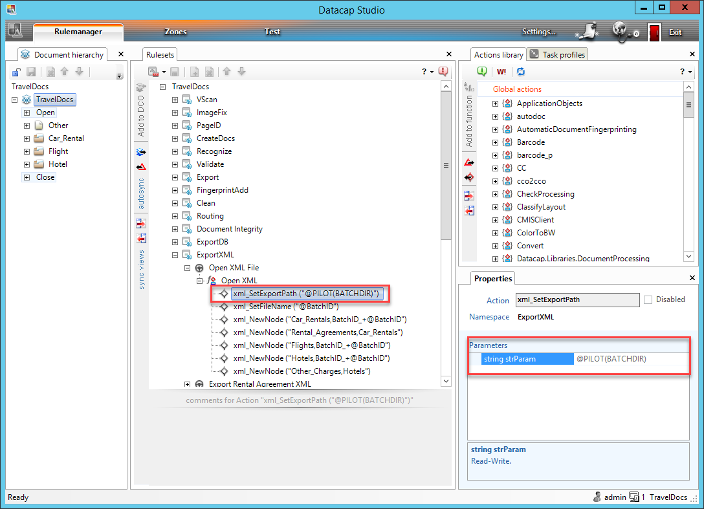

# Datacap Utils Toolkit

Datacap Utils Toolkit is a collection of re-usable artifacts useful for integration with IBM Datacap REST services from IBM Business Automation Workflow.

Repository: <a href="https://github.com/apollo-business-automation/datacap-utils-toolkit" target="_blank">https://github.com/apollo-business-automation/datacap-utils-toolkit</a>

API: <a href="https://apollo-business-automation.github.io/datacap-utils-toolkit/" target="_blank">https://apollo-business-automation.github.io/datacap-utils-toolkit/</a>

## Description

The toolkit provides integration with Transactions which are provided via the Datacap Web Services REST API documented at https://www.ibm.com/docs/en/datacap/9.1.9?topic=reference-datacap-web-services-rest-api-methods

## Content of the toolkit

- Service flows – wrappers for transaction API calls
  - Session Logon
  - Session Logoff
  - Transaction Start
  - Transaction Execute
  - Transaction End
  - Transaction Set File
  - Transaction Get File
- Sample transaction flow for TravelDocs application which comes out-of-the-box with Datacap.
- Recoding of files from UTF-16 LE BOM and UTF-8 BOM to UTF-8
- Sample process with a task allowing:
  - Upload and select document
  - Select the transaction REST endpoint
  - Call the transaction flow and see the output

## Making Traveldocs Datacap application ready for transactions

A slight adjustment of the Datacap application is needed in order to make it ready for transactions.

Instructions:
- Open TravelDocs application in Datacap Studio.
- Select and lock ruleset `ExportXML` for editing.
- Navigate to the action following the screenshot below.
- Update value of the action parameter on the right hand side to `@PILOT(BATCHDIR)`
- Save the changes and publish the ruleset.

## Usage

- Import the release twx file into Workflow Center
- Start process `ZTest Datacap Transaction`
- Run task `ZTest Datacap Transaction` and open the task screen
- Select one of the sample files already attached to the process instance or upload your file.
- Review the REST endpoint configuration and update it if needed.
- Select conversion from the proper UTF encoding. It may differ depending on on configuration of your Datacap.
- Click the button to call the transaction.
- See the output.

You can adjust the REST endpoint in CSHS `ZTest Datacap TravelDocs Cshs Coach`. Edit the script called `Init`.